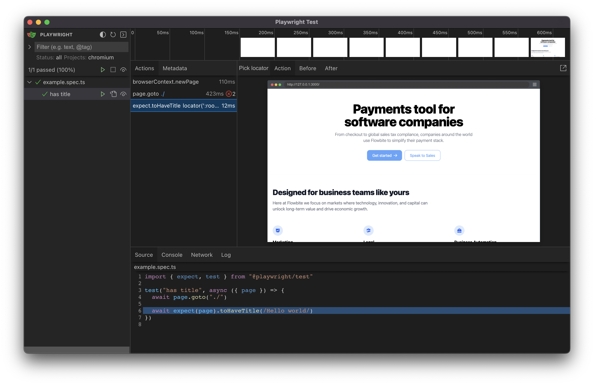

# 🧪 Testing

This boilerplate comes with various testing setups to ensure your application's reliability and robustness.

## Running Tests

- **Unit and integration tests**: Run Jest tests using `yarn test`
- **End-to-end tests (headless mode)**: Run Playwright tests in headless mode with `yarn e2e:headless`
- **End-to-end tests (UI mode)**: Run Playwright tests with UI using `yarn e2e:ui`



## Acceptance Tests

To write acceptance tests, we leverage Storybook's [`play` function](https://storybook.js.org/docs/react/writing-stories/play-function#writing-stories-with-the-play-function). This allows you to interact with your components and test various user flows within Storybook.

```ts
/*
 * See https://storybook.js.org/docs/react/writing-stories/play-function#working-with-the-canvas
 * to learn more about using the canvasElement to query the DOM
 */
export const FilledForm: Story = {
  play: async ({ canvasElement }) => {
    const canvas = within(canvasElement)

    const emailInput = canvas.getByLabelText("email", {
      selector: "input",
    })

    await userEvent.type(emailInput, "example-email@email.com", {
      delay: 100,
    })

    const passwordInput = canvas.getByLabelText("password", {
      selector: "input",
    })

    await userEvent.type(passwordInput, "ExamplePassword", {
      delay: 100,
    })
    // See https://storybook.js.org/docs/react/essentials/actions#automatically-matching-args to learn how to setup logging in the Actions panel
    const submitButton = canvas.getByRole("button")

    await userEvent.click(submitButton)
  },
}
```

## Smoke Testing

In this boilerplate, we use Storybook's out-of-the-box support for smoke testing to verify that components render correctly without any errors. Just run `yarn test-storybook` to perform smoke testing. Remember to write stories in JSX or TSX format only. Smoke testing and a lot of other functionalities dont work well with MDX stories.
