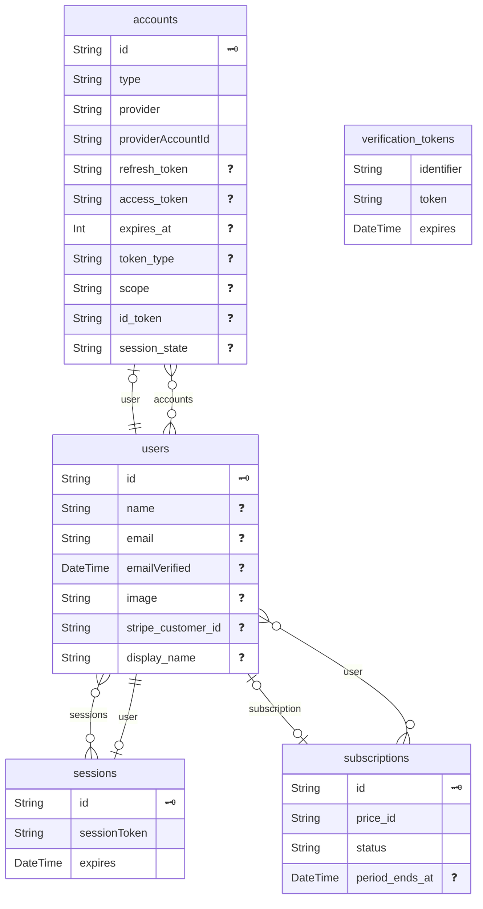

```mermaid
erDiagram

  "accounts" {
    String id "🗝️"
    String type 
    String provider 
    String providerAccountId 
    String refresh_token "❓"
    String access_token "❓"
    Int expires_at "❓"
    String token_type "❓"
    String scope "❓"
    String id_token "❓"
    String session_state "❓"
    }
  

  "sessions" {
    String id "🗝️"
    String sessionToken 
    DateTime expires 
    }
  

  "users" {
    String id "🗝️"
    String name "❓"
    String email "❓"
    DateTime emailVerified "❓"
    String image "❓"
    String stripe_customer_id "❓"
    String display_name "❓"
    }
  

  "verification_tokens" {
    String identifier 
    String token 
    DateTime expires 
    }
  

  "subscriptions" {
    String id "🗝️"
    String price_id 
    String status 
    DateTime period_ends_at "❓"
    }
  
    "accounts" o|--|| "users" : "user"
    "sessions" o|--|| "users" : "user"
    "users" o{--}o "accounts" : "accounts"
    "users" o{--}o "sessions" : "sessions"
    "users" o|--|o "subscriptions" : "subscription"
    "subscriptions" o{--}o "users" : "user"
```
